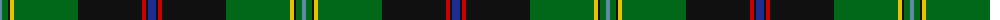

The parent of this is [Roderick Dhu Canada Tartan Tartan Number: 153. Earliest known date: 1967 Roderick Dhu is linked to the MacNeil Clan. There is also a whisky of the same name. See products available Copyright © Blair Urquhart, Comrie, 2015](/tartans/b/4/g6/k2/y4/g64/k64/r4/k2/db/8/)

This was sourced from house-of-tartan.  It is a [9 stripes tartan](/stripes/stripes9/).

Original link http://www.house-of-tartan.scotland.net/house/TartanViewjs.asp?colr=Def&tnam=153

## Thread count
B/4 G6 K2 Y4 G64 K64 R4 K2 DB/8

## Palette
Each colour and its ΔE from the base-6 reference it is a variant of.

| Colour | Shade | Base | ΔE (OKLab) |
|---|---|---|---|
| B |  `#5C8CA8` | B  | 0.23 |
| DB |  `#1C2C90` | B  | 0.06 |
| DBa |  `#202060` | B  | 0.11 |
| G |  `#006818` | G  | 0.02 |
| K |  `#101010` | K  | 0.17 |
| R |  `#C80000` | R  | 0.00 |
| Y |  `#E8C000` | Y  | 0.00 |

ID: /variants/b/4/g6/k2/y4/g64/k64/r4/k2/db/8-b5c8ca8-db1c2c90-dba202060-g006818-k101010-rc80000-ye8c000/
