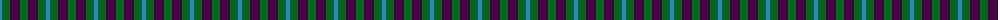
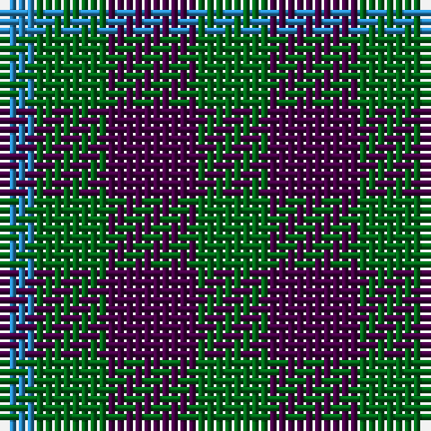

The parent of this is [Wilson's No.209](/tartans/b/4/g8/dp10/g/8/)

This was sourced from register-of-tartans.  It is a [4 stripes tartan](/stripes/stripes4/).

Original link https://www.tartanregister.gov.uk/tartanDetails.aspx?ref=4740

## Thread count
B/4 G8 DP10 G/8

## Palette
Each colour and its ΔE from the base-6 reference it is a variant of.

| Colour | Shade | Base | ΔE (OKLab) |
|---|---|---|---|
| B |  `#2888C4` | B  | 0.21 |
| DG |  `#003820` | G  | 0.16 |
| DP |  `#440044` | B  | 0.17 |
| G |  `#006818` | G  | 0.02 |
| LG |  `#789484` | G  | 0.23 |

# Sample pattern

ID: /variants/b/4/g8/dp10/g/8-b2888c4-dg003820-dp440044-g006818-lg789484/
