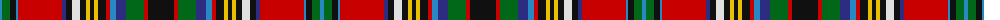

The parent of this is [Anderson of Ardbrake Clan/Family Tartan Tartan Number: 7024. Earliest known date: 2006 May Designed by David A R Waterton-Anderson, Chairman of the Anderson Association in answer to requests from some members for an Anderson tartan with with a red, rather than a light blue bakcground. His notes on the design are as follows: "The Anderson family of Ardbrake in Banffshire is amongst the principal families of the name. Evidence from many sources over five centuries show a high intermarriage and association with the powerful clan Gordon plus many other families in the north-east of Scotland, many of whom have tartans in strong red hues. The majority of tartans ascribed to the name Anderson embody a clear motif of a broad white and two yellow (tramline) stripes set on black and this new design follows this traditional feature." See products available Copyright © Blair Urquhart, Comrie, 2015](/tartans/b/4/g8/k6/b2/r44/db4/k6/ln8/k6/y4/k4/y4/k8/r4/b6/db10/g18/r4/k/26/)

This was sourced from house-of-tartan.  It is a [19 stripes tartan](/stripes/stripes19/).

Original link http://www.house-of-tartan.scotland.net/house/TartanViewjs.asp?colr=Def&tnam=7024

## Thread count
B/4 G8 K6 B2 R44 DB4 K6 LN8 K6 Y4 K4 Y4 K8 R4 B6 DB10 G18 R4 K/26

## Palette
Each colour and its ΔE from the base-6 reference it is a variant of.

| Colour | Shade | Base | ΔE (OKLab) |
|---|---|---|---|
| B |  `#2888C4` | B  | 0.21 |
| DB |  `#2C2C80` | B  | 0.05 |
| G |  `#006818` | G  | 0.02 |
| K |  `#101010` | K  | 0.17 |
| LN |  `#E0E0E0` | W  | 0.06 |
| R |  `#C80000` | R  | 0.00 |
| Y |  `#E8C000` | Y  | 0.00 |

ID: /variants/b/4/g8/k6/b2/r44/db4/k6/ln8/k6/y4/k4/y4/k8/r4/b6/db10/g18/r4/k/26-b2888c4-db2c2c80-g006818-k101010-lne0e0e0-rc80000-ye8c000/
