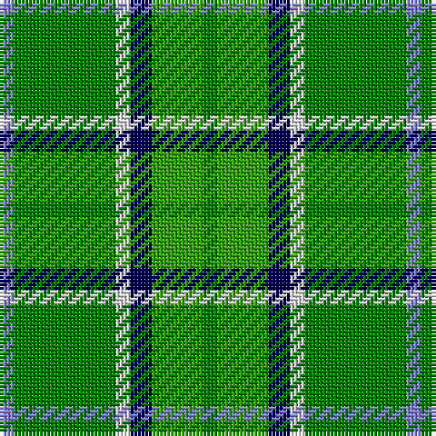

The parent of this is [Manx, Ellan Vannin](/tartans/b/4/ga28/ln4/db6/g14/ga/4/)

This was sourced from weddslist.  It is a [6 stripes tartan](/stripes/stripes6/).

Original link http://www.weddslist.com/cgi-bin/tartans/pg.pl?source=sts

## Thread count
B/4 Ga28 LN4 DB6 G14 Ga/4

## Palette
Each colour and its ΔE from the base-6 reference it is a variant of.

| Colour | Shade | Base | ΔE (OKLab) |
|---|---|---|---|
| B |  `#8080D0` | B  | 0.24 |
| DB |  `#000050` | B  | 0.20 |
| G |  `#30A010` | G  | 0.19 |
| Ga |  `#008000` | G  | 0.09 |
| LN |  `#E0E0E0` | W  | 0.06 |

# Sample pattern

ID: /variants/b/4/ga28/ln4/db6/g14/ga/4-b8080d0-db000050-g30a010-ga008000-lne0e0e0/
