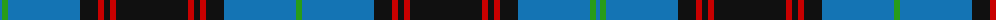

The parent of this is [Home (Clans Originaux)](/tartans/b/4/ga6/b72/k18/r6/k6/r6/k72/r6/k6/r6/k18/b72/ga/6/)

This was sourced from register-of-tartans.  It is a [14 stripes tartan](/stripes/stripes14/).

Original link https://www.tartanregister.gov.uk/tartanDetails.aspx?ref=1757

## Thread count
B/4 Ga6 B72 K18 R6 K6 R6 K72 R6 K6 R6 K18 B72 Ga/6

## Palette
Each colour and its ΔE from the base-6 reference it is a variant of.

| Colour | Shade | Base | ΔE (OKLab) |
|---|---|---|---|
| B |  `#1474B4` | B  | 0.15 |
| DB |  `#2C2C80` | B  | 0.05 |
| G |  `#006818` | G  | 0.02 |
| Ga |  `#289C18` | G  | 0.18 |
| K |  `#101010` | K  | 0.17 |
| R |  `#C80000` | R  | 0.00 |

ID: /variants/b/4/ga6/b72/k18/r6/k6/r6/k72/r6/k6/r6/k18/b72/ga/6-b1474b4-db2c2c80-g006818-ga289c18-k101010-rc80000/
