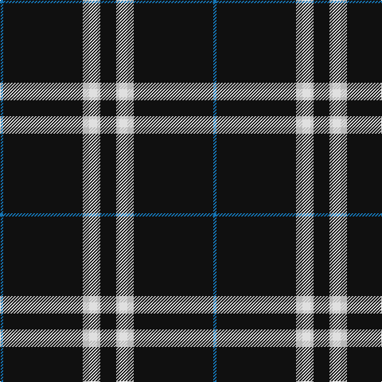

The parent of this is [London Fog Black (Fashion)](/tartans/b/4/k100/n8/ln10/n4/k/20/)

This was sourced from tartans-authority.  It is a [6 stripes tartan](/stripes/stripes6/).

Original link http://www.tartansauthority.com/tartan-ferret/display/7269/

## Thread count
B/4 K100 N8 LN10 N4 K/20

## Palette
Each colour and its ΔE from the base-6 reference it is a variant of.

| Colour | Shade | Base | ΔE (OKLab) |
|---|---|---|---|
| B |  `#1474B4` | B  | 0.15 |
| K |  `#101010` | K  | 0.17 |
| LN |  `#E0E0E0` | W  | 0.06 |
| N |  `#B8B8B8` | Y  | 0.17 |

# Sample pattern

ID: /variants/b/4/k100/n8/ln10/n4/k/20-b1474b4-k101010-lne0e0e0-nb8b8b8/
