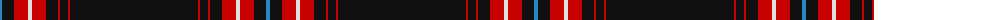

The parent of this is [Noordermeer (Personal)](/tartans/b/4/k12/r14/ln4/r14/k12/r2/k8/r2/k/128/)

This was sourced from tartans-authority.  It is a [10 stripes tartan](/stripes/stripes10/).

Original link http://www.tartansauthority.com/tartan-ferret/display/6357/

## Thread count
B/4 K12 R14 LN4 R14 K12 R2 K8 R2 K/128

## Palette
Each colour and its ΔE from the base-6 reference it is a variant of.

| Colour | Shade | Base | ΔE (OKLab) |
|---|---|---|---|
| B |  `#2888C4` | B  | 0.21 |
| K |  `#101010` | K  | 0.17 |
| LN |  `#E0E0E0` | W  | 0.06 |
| R |  `#C80000` | R  | 0.00 |

ID: /variants/b/4/k12/r14/ln4/r14/k12/r2/k8/r2/k/128-b2888c4-k101010-lne0e0e0-rc80000/
