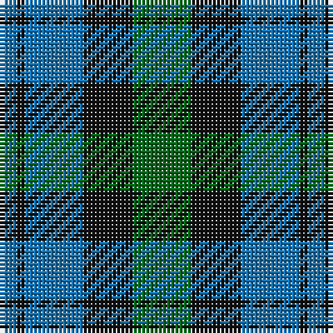

The parent of this is [Campbell of Glenlyon Check (Clan)](/tartans/b/4/k2/b14/k12/g/14/)

This was sourced from tartans-authority.  It is a [5 stripes tartan](/stripes/stripes5/).

Original link http://www.tartansauthority.com/tartan-ferret/display/14/

## Thread count
B/4 K2 B14 K12 G/14

## Palette
Each colour and its ΔE from the base-6 reference it is a variant of.

| Colour | Shade | Base | ΔE (OKLab) |
|---|---|---|---|
| B |  `#1474B4` | B  | 0.15 |
| G |  `#006818` | G  | 0.02 |
| K |  `#101010` | K  | 0.17 |

# Sample pattern

ID: /variants/b/4/k2/b14/k12/g/14-b1474b4-g006818-k101010/
