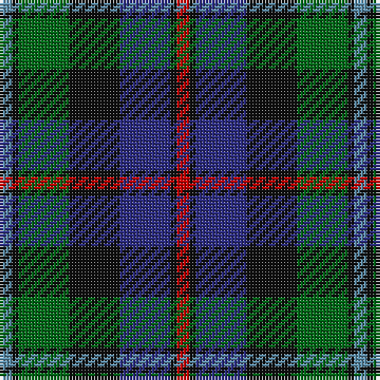

The parent of this is [Argyll District Tartan Tartan Number: 2079. Earliest known date: 1798 W & S Smith (1850) records this pattern as Cawdor Campbell. Wilson records it as Argyll in 1819 (No. 230) and refers to an Argyll tartan in a letter of 1798. W. and A.K. Johnston (1906) calls it Argyll District tartan. See products available Copyright © Blair Urquhart, Comrie, 2015](/tartans/b/4/k2/g16/k16/db16/k2/r/4/)

This was sourced from house-of-tartan.  It is a [7 stripes tartan](/stripes/stripes7/).

Original link http://www.house-of-tartan.scotland.net/house/TartanViewjs.asp?colr=Def&tnam=2079

## Thread count
B/4 K2 G16 K16 DB16 K2 R/4

## Palette
Each colour and its ΔE from the base-6 reference it is a variant of.

| Colour | Shade | Base | ΔE (OKLab) |
|---|---|---|---|
| B |  `#5C8CA8` | B  | 0.23 |
| DB |  `#2C2C80` | B  | 0.05 |
| G |  `#006818` | G  | 0.02 |
| K |  `#101010` | K  | 0.17 |
| R |  `#C80000` | R  | 0.00 |

# Sample pattern

ID: /variants/b/4/k2/g16/k16/db16/k2/r/4-b5c8ca8-db2c2c80-g006818-k101010-rc80000/
