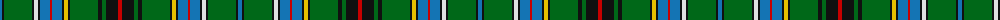

The parent of this is [Duncan of Sketraw (Name)](/tartans/b/4/k2/g28/k2/ln4/k2/b10/r2/b10/k2/y4/k2/g28/k4/g4/k12/r/4/)

This was sourced from tartans-authority.  It is a [17 stripes tartan](/stripes/stripes17/).

Original link http://www.tartansauthority.com/tartan-ferret/display/6497/

## Thread count
B/4 K2 G28 K2 LN4 K2 B10 R2 B10 K2 Y4 K2 G28 K4 G4 K12 R/4

## Palette
Each colour and its ΔE from the base-6 reference it is a variant of.

| Colour | Shade | Base | ΔE (OKLab) |
|---|---|---|---|
| B |  `#1474B4` | B  | 0.15 |
| G |  `#006818` | G  | 0.02 |
| K |  `#101010` | K  | 0.17 |
| LN |  `#E0E0E0` | W  | 0.06 |
| R |  `#C80000` | R  | 0.00 |
| Y |  `#E8C000` | Y  | 0.00 |

ID: /variants/b/4/k2/g28/k2/ln4/k2/b10/r2/b10/k2/y4/k2/g28/k4/g4/k12/r/4-b1474b4-g006818-k101010-lne0e0e0-rc80000-ye8c000/
