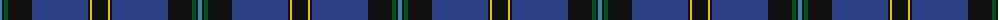

The parent of this is [Hope-Weir/Weir](/tartans/b/4/k2/g4/k24/ba56/k2/y2/k/16/)

This was sourced from register-of-tartans.  It is a [8 stripes tartan](/stripes/stripes8/).

Original link https://www.tartanregister.gov.uk/tartanDetails.aspx?ref=1766

## Thread count
B/4 K2 G4 K24 Ba56 K2 Y2 K/16

## Palette
Each colour and its ΔE from the base-6 reference it is a variant of.

| Colour | Shade | Base | ΔE (OKLab) |
|---|---|---|---|
| B |  `#3C82AF` | B  | 0.20 |
| Ba |  `#2C4084` | B  | 0.00 |
| G |  `#005020` | G  | 0.08 |
| K |  `#101010` | K  | 0.17 |
| Y |  `#E8C000` | Y  | 0.00 |

# Sample pattern

ID: /variants/b/4/k2/g4/k24/ba56/k2/y2/k/16-b3c82af-ba2c4084-g005020-k101010-ye8c000/
