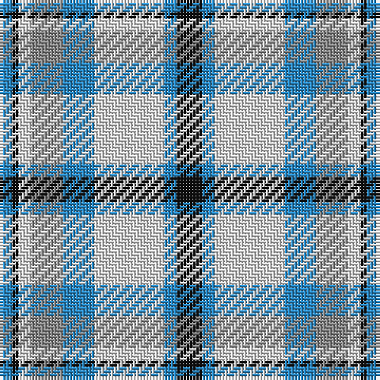

The parent of this is [Conquergood (Name)](/tartans/b/4/k2/ln4/n10/b10/ln22/b4/k/8/)

This was sourced from tartans-authority.  It is a [8 stripes tartan](/stripes/stripes8/).

Original link http://www.tartansauthority.com/tartan-ferret/display/2095/

## Thread count
B/4 K2 LN4 N10 B10 LN22 B4 K/8

## Palette
Each colour and its ΔE from the base-6 reference it is a variant of.

| Colour | Shade | Base | ΔE (OKLab) |
|---|---|---|---|
| B |  `#2888C4` | B  | 0.21 |
| K |  `#101010` | K  | 0.17 |
| LN |  `#E0E0E0` | W  | 0.06 |
| N |  `#888888` | R  | 0.24 |

# Sample pattern

ID: /variants/b/4/k2/ln4/n10/b10/ln22/b4/k/8-b2888c4-k101010-lne0e0e0-n888888/
