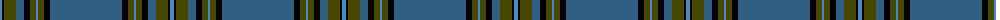

The parent of this is [Chateau (Fashion)](/tartans/b/4/k2/t12/ba8/k6/t6/b2/t6/k6/ba/72/)

This was sourced from tartans-authority.  It is a [10 stripes tartan](/stripes/stripes10/).

Original link http://www.tartansauthority.com/tartan-ferret/display/4490/

## Thread count
B/4 K2 T12 Ba8 K6 T6 B2 T6 K6 Ba/72

## Palette
Each colour and its ΔE from the base-6 reference it is a variant of.

| Colour | Shade | Base | ΔE (OKLab) |
|---|---|---|---|
| B |  `#488CC0` | B  | 0.23 |
| Ba |  `#306084` | B  | 0.10 |
| K |  `#000000` | K  | 0.00 |
| T |  `#484800` | G  | 0.10 |

ID: /variants/b/4/k2/t12/ba8/k6/t6/b2/t6/k6/ba/72-b488cc0-ba306084-k000000-t484800/
