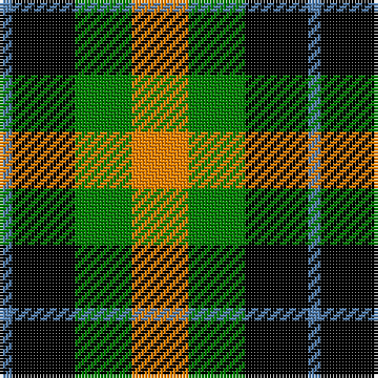

The parent of this is [Wilson's, No 196](/tartans/b/4/k20/g18/o/18/)

This was sourced from weddslist.  It is a [4 stripes tartan](/stripes/stripes4/).

Original link http://www.weddslist.com/cgi-bin/tartans/pg.pl?source=sts

## Thread count
B/4 K20 G18 O/18

## Palette
Each colour and its ΔE from the base-6 reference it is a variant of.

| Colour | Shade | Base | ΔE (OKLab) |
|---|---|---|---|
| B |  `#5480B0` | B  | 0.20 |
| G |  `#008000` | G  | 0.09 |
| K |  `#000000` | K  | 0.00 |
| O |  `#FF8500` | Y  | 0.14 |

# Sample pattern

ID: /variants/b/4/k20/g18/o/18-b5480b0-g008000-k000000-off8500/
