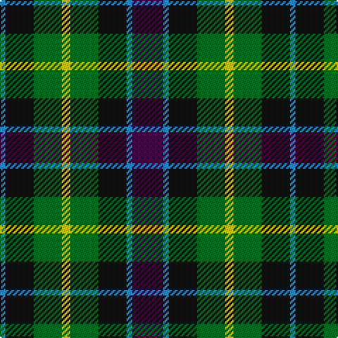

The parent of this is [Wilson's No.217](/tartans/b/4/k20/g20/y6/g20/k20/b4/dp/22/)

This was sourced from register-of-tartans.  It is a [8 stripes tartan](/stripes/stripes8/).

Original link https://www.tartanregister.gov.uk/tartanDetails.aspx?ref=4746

## Thread count
B/4 K20 G20 Y6 G20 K20 B4 DP/22

## Palette
Each colour and its ΔE from the base-6 reference it is a variant of.

| Colour | Shade | Base | ΔE (OKLab) |
|---|---|---|---|
| B |  `#2888C4` | B  | 0.21 |
| DG |  `#003820` | G  | 0.16 |
| DP |  `#440044` | B  | 0.17 |
| G |  `#006818` | G  | 0.02 |
| K |  `#101010` | K  | 0.17 |
| Y |  `#E8C000` | Y  | 0.00 |

# Sample pattern

ID: /variants/b/4/k20/g20/y6/g20/k20/b4/dp/22-b2888c4-dg003820-dp440044-g006818-k101010-ye8c000/
