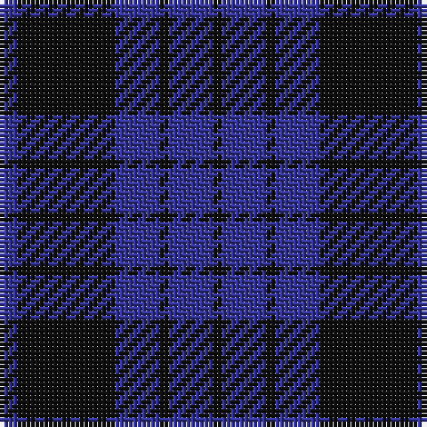

The parent of this is [Gagetown (School)](/tartans/b/4/k22/b10/k2/b10/k/2/)

This was sourced from tartans-authority.  It is a [6 stripes tartan](/stripes/stripes6/).

Original link http://www.tartansauthority.com/tartan-ferret/display/7557/

## Thread count
B/4 K22 B10 K2 B10 K/2

## Palette
Each colour and its ΔE from the base-6 reference it is a variant of.

| Colour | Shade | Base | ΔE (OKLab) |
|---|---|---|---|
| B |  `#343498` | B  | 0.05 |
| K |  `#101010` | K  | 0.17 |

# Sample pattern

ID: /variants/b/4/k22/b10/k2/b10/k/2-b343498-k101010/
