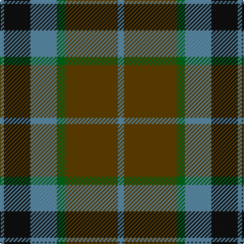

The parent of this is [MacTavish Hunting Clan Tartan Tartan Number: 232. Earliest known date: pre 2003 See Lord Thomson See products available Copyright © Blair Urquhart, Comrie, 2015](/tartans/b/4/k26/b26/g8/t52/b/6/)

This was sourced from house-of-tartan.  It is a [6 stripes tartan](/stripes/stripes6/).

Original link http://www.house-of-tartan.scotland.net/house/TartanViewjs.asp?colr=Def&tnam=232

## Thread count
B/4 K26 B26 G8 T52 B/6

## Palette
Each colour and its ΔE from the base-6 reference it is a variant of.

| Colour | Shade | Base | ΔE (OKLab) |
|---|---|---|---|
| B |  `#5C8CA8` | B  | 0.23 |
| G |  `#006818` | G  | 0.02 |
| K |  `#101010` | K  | 0.17 |
| T |  `#604000` | G  | 0.14 |

# Sample pattern

ID: /variants/b/4/k26/b26/g8/t52/b/6-b5c8ca8-g006818-k101010-t604000/
