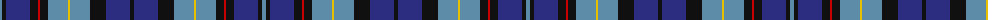

The parent of this is [Auchinachie Name Tartan Tartan Number: 10014. Earliest known date: Mar. 2009 This is a family tartan designed for Mr Peter Auchinachie, and available for use by all of the name. See products available Copyright © Blair Urquhart, Comrie, 2015](/tartans/b/4/k4/db24/k8/r2/k8/b20/y2/b20/k16/db24/k/4/)

This was sourced from house-of-tartan.  It is a [12 stripes tartan](/stripes/stripes12/).

Original link http://www.house-of-tartan.scotland.net/house/TartanViewjs.asp?colr=Def&tnam=10014

## Thread count
B/4 K4 DB24 K8 R2 K8 B20 Y2 B20 K16 DB24 K/4

## Palette
Each colour and its ΔE from the base-6 reference it is a variant of.

| Colour | Shade | Base | ΔE (OKLab) |
|---|---|---|---|
| B |  `#5C8CA8` | B  | 0.23 |
| DB |  `#2C2C80` | B  | 0.05 |
| G |  `#006818` | G  | 0.02 |
| K |  `#101010` | K  | 0.17 |
| R |  `#C80000` | R  | 0.00 |
| Y |  `#E8C000` | Y  | 0.00 |

ID: /variants/b/4/k4/db24/k8/r2/k8/b20/y2/b20/k16/db24/k/4-b5c8ca8-db2c2c80-g006818-k101010-rc80000-ye8c000/
