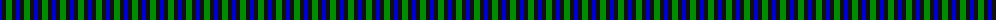
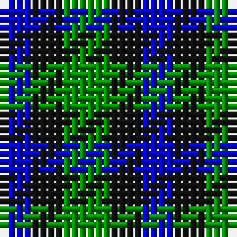

The parent of this is [Glenlyon #2](/tartans/b/4/k4/g/6/)

This was sourced from register-of-tartans.  It is a [3 stripes tartan](/stripes/stripes3/).

Original link https://www.tartanregister.gov.uk/tartanDetails.aspx?ref=5457

## Thread count
B/4 K4 G/6

## Palette
Each colour and its ΔE from the base-6 reference it is a variant of.

| Colour | Shade | Base | ΔE (OKLab) |
|---|---|---|---|
| B |  `#0000CD` | B  | 0.15 |
| G |  `#008B00` | G  | 0.12 |
| K |  `#101010` | K  | 0.17 |

# Sample pattern

ID: /variants/b/4/k4/g/6-b0000cd-g008b00-k101010/
