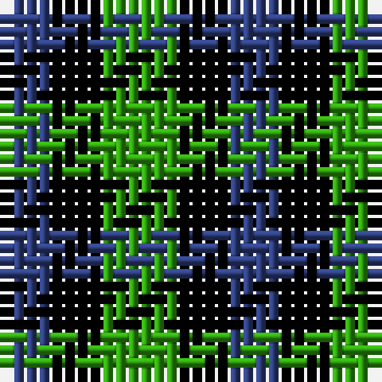

The parent of this is [Glen Lyon](/tartans/b/4/k4/g/6/)

This was sourced from weddslist.  It is a [3 stripes tartan](/stripes/stripes3/).

Original link http://www.weddslist.com/cgi-bin/tartans/pg.pl?source=sts

## Thread count
B/4 K4 G/6

## Palette
Each colour and its ΔE from the base-6 reference it is a variant of.

| Colour | Shade | Base | ΔE (OKLab) |
|---|---|---|---|
| B |  `#304080` | B  | 0.01 |
| G |  `#30A010` | G  | 0.19 |
| K |  `#000000` | K  | 0.00 |

# Sample pattern

ID: /variants/b/4/k4/g/6-b304080-g30a010-k000000/
