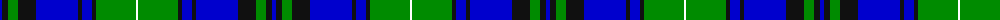

The parent of this is [Pitceathly Chamberlain (Personal)](/tartans/b/4/k6/g10/k18/b42/k4/b10/k4/g40/w/2/)

This was sourced from register-of-tartans.  It is a [10 stripes tartan](/stripes/stripes10/).

Original link https://www.tartanregister.gov.uk/tartanDetails.aspx?ref=10190

## Thread count
B/4 K6 G10 K18 B42 K4 B10 K4 G40 W/2

## Palette
Each colour and its ΔE from the base-6 reference it is a variant of.

| Colour | Shade | Base | ΔE (OKLab) |
|---|---|---|---|
| B |  `#0000CD` | B  | 0.15 |
| G |  `#008B00` | G  | 0.12 |
| K |  `#101010` | K  | 0.17 |
| W |  `#FFFFFF` | W  | 0.03 |

ID: /variants/b/4/k6/g10/k18/b42/k4/b10/k4/g40/w/2-b0000cd-g008b00-k101010-wffffff/
