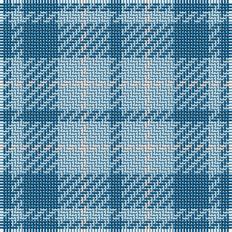

The parent of this is [Langdons (Corporate)](/tartans/b/4/lb4/b12/lb8/ln2/lb8/b/4/)

This was sourced from tartans-authority.  It is a [7 stripes tartan](/stripes/stripes7/).

Original link http://www.tartansauthority.com/tartan-ferret/display/10103/

## Thread count
B/4 LB4 B12 LB8 LN2 LB8 B/4

## Palette
Each colour and its ΔE from the base-6 reference it is a variant of.

| Colour | Shade | Base | ΔE (OKLab) |
|---|---|---|---|
| B |  `#1C6894` | B  | 0.11 |
| LB |  `#98C8E8` | W  | 0.17 |
| LN |  `#E0E0E0` | W  | 0.06 |

# Sample pattern

ID: /variants/b/4/lb4/b12/lb8/ln2/lb8/b/4-b1c6894-lb98c8e8-lne0e0e0/
