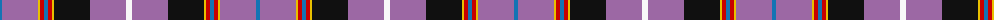

The parent of this is [Selkirk High (Corporate)](/tartans/b/4/lp36/y2/r4/b4/r4/y2/k36/lp36/w/6/)

This was sourced from tartans-authority.  It is a [10 stripes tartan](/stripes/stripes10/).

Original link http://www.tartansauthority.com/tartan-ferret/display/6846/

## Thread count
B/4 LP36 Y2 R4 B4 R4 Y2 K36 LP36 W/6

## Palette
Each colour and its ΔE from the base-6 reference it is a variant of.

| Colour | Shade | Base | ΔE (OKLab) |
|---|---|---|---|
| B |  `#1474B4` | B  | 0.15 |
| K |  `#101010` | K  | 0.17 |
| LP |  `#9C68A4` | R  | 0.21 |
| R |  `#C80000` | R  | 0.00 |
| W |  `#F8F8F8` | W  | 0.01 |
| Y |  `#E8C000` | Y  | 0.00 |

ID: /variants/b/4/lp36/y2/r4/b4/r4/y2/k36/lp36/w/6-b1474b4-k101010-lp9c68a4-rc80000-wf8f8f8-ye8c000/
