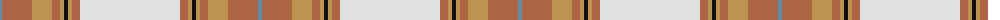

The parent of this is [Australian Dress District Tartan Tartan Number: 612. Earliest known date: 1987 Information from the Scottish Australian Heritage Council See products available Copyright © Blair Urquhart, Comrie, 2015](/tartans/b/4/lt30/lta20/lt8/lta4/k4/lta4/lt8/ln/100/)

This was sourced from house-of-tartan.  It is a [9 stripes tartan](/stripes/stripes9/).

Original link http://www.house-of-tartan.scotland.net/house/TartanViewjs.asp?colr=Def&tnam=612

## Thread count
B/4 LT30 LTa20 LT8 LTa4 K4 LTa4 LT8 LN/100

## Palette
Each colour and its ΔE from the base-6 reference it is a variant of.

| Colour | Shade | Base | ΔE (OKLab) |
|---|---|---|---|
| B |  `#5C8CA8` | B  | 0.23 |
| K |  `#101010` | K  | 0.17 |
| LN |  `#E0E0E0` | W  | 0.06 |
| LT |  `#AC6444` | R  | 0.13 |
| LTa |  `#BC9450` | Y  | 0.15 |

ID: /variants/b/4/lt30/lta20/lt8/lta4/k4/lta4/lt8/ln/100-b5c8ca8-k101010-lne0e0e0-ltac6444-ltabc9450/
