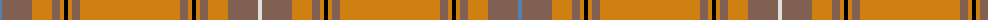

The parent of this is [Australian, The](/tartans/b/4/lt30/o20/lt8/o4/k4/o4/lt8/o100/lt8/o4/k4/o4/lt8/o20/lt30/ln/4/)

This was sourced from weddslist.  It is a [17 stripes tartan](/stripes/stripes17/).

Original link http://www.weddslist.com/cgi-bin/tartans/pg.pl?source=sts

## Thread count
B/4 LT30 O20 LT8 O4 K4 O4 LT8 O100 LT8 O4 K4 O4 LT8 O20 LT30 LN/4

## Palette
Each colour and its ΔE from the base-6 reference it is a variant of.

| Colour | Shade | Base | ΔE (OKLab) |
|---|---|---|---|
| B |  `#5480B0` | B  | 0.20 |
| K |  `#000000` | K  | 0.00 |
| LN |  `#E0E0E0` | W  | 0.06 |
| LT |  `#806050` | R  | 0.17 |
| O |  `#D08010` | Y  | 0.17 |

ID: /variants/b/4/lt30/o20/lt8/o4/k4/o4/lt8/o100/lt8/o4/k4/o4/lt8/o20/lt30/ln/4-b5480b0-k000000-lne0e0e0-lt806050-od08010/
