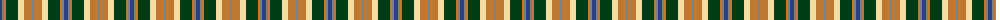
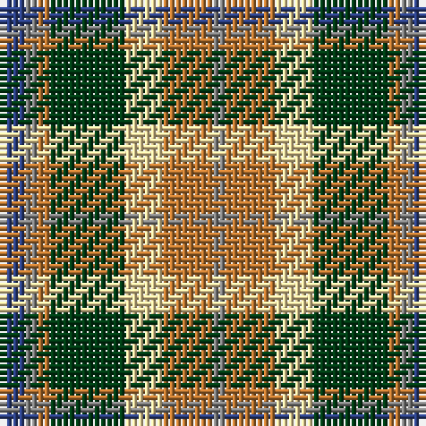

The parent of this is [Equorian Olympic](/tartans/b/4/n2/do2/dg12/ly6/do6/do2/n/2/)

This was sourced from register-of-tartans.  It is a [8 stripes tartan](/stripes/stripes8/).

Original link https://www.tartanregister.gov.uk/tartanDetails.aspx?ref=1118

## Thread count
B/4 N2 DO2 DG12 LY6 DO6 DO2 N/2

## Palette
Each colour and its ΔE from the base-6 reference it is a variant of.

| Colour | Shade | Base | ΔE (OKLab) |
|---|---|---|---|
| B |  `#2C4084` | B  | 0.00 |
| DG |  `#003C14` | G  | 0.14 |
| DO |  `#BE7832` | R  | 0.17 |
| LY |  `#F5DCA0` | W  | 0.10 |
| N |  `#808080` | G  | 0.22 |

# Sample pattern

ID: /variants/b/4/n2/do2/dg12/ly6/do6/do2/n/2-b2c4084-dg003c14-dobe7832-lyf5dca0-n808080/
