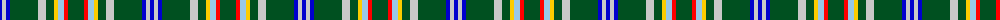

The parent of this is [Lévesque, Pascal (Personal)](/tartans/b/4/n4/b4/g28/n8/g8/y4/lb6/r4/g/16/)

This was sourced from register-of-tartans.  It is a [10 stripes tartan](/stripes/stripes10/).

Original link https://www.tartanregister.gov.uk/tartanDetails.aspx?ref=11559

## Thread count
B/4 N4 B4 G28 N8 G8 Y4 LB6 R4 G/16

## Palette
Each colour and its ΔE from the base-6 reference it is a variant of.

| Colour | Shade | Base | ΔE (OKLab) |
|---|---|---|---|
| B |  `#0000CD` | B  | 0.15 |
| G |  `#005020` | G  | 0.08 |
| LB |  `#98C8E8` | W  | 0.17 |
| N |  `#C8C8C8` | W  | 0.13 |
| R |  `#FF0000` | R  | 0.11 |
| Y |  `#FCCC00` | Y  | 0.04 |

ID: /variants/b/4/n4/b4/g28/n8/g8/y4/lb6/r4/g/16-b0000cd-g005020-lb98c8e8-nc8c8c8-rff0000-yfccc00/
