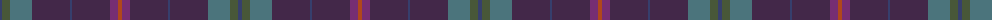

The parent of this is [Brigid Mhairi](/tartans/b/4/n8/g22/dp38/b2/dp38/p8/t/4/)

This was sourced from register-of-tartans.  It is a [8 stripes tartan](/stripes/stripes8/).

Original link https://www.tartanregister.gov.uk/tartanDetails.aspx?ref=10401

## Thread count
B/4 N8 G22 DP38 B2 DP38 P8 T/4

## Palette
Each colour and its ΔE from the base-6 reference it is a variant of.

| Colour | Shade | Base | ΔE (OKLab) |
|---|---|---|---|
| B |  `#363F6D` | B  | 0.04 |
| DP |  `#432849` | B  | 0.12 |
| G |  `#4B747C` | G  | 0.17 |
| N |  `#485738` | G  | 0.10 |
| P |  `#762E73` | B  | 0.13 |
| T |  `#B0471C` | R  | 0.08 |

# Sample pattern

ID: /variants/b/4/n8/g22/dp38/b2/dp38/p8/t/4-b363f6d-dp432849-g4b747c-n485738-p762e73-tb0471c/
