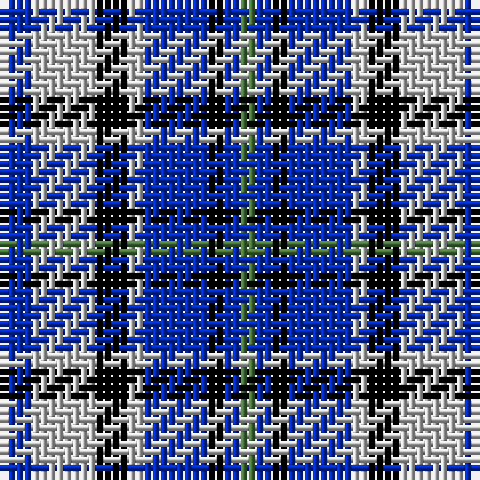

The parent of this is [Culloden - 1977 (Fashion)](/tartans/b/4/n8/k4/n2/b8/k2/b2/g/2/)

This was sourced from tartans-authority.  It is a [8 stripes tartan](/stripes/stripes8/).

Original link http://www.tartansauthority.com/tartan-ferret/display/4622/

## Thread count
B/4 N8 K4 N2 B8 K2 B2 G/2

## Palette
Each colour and its ΔE from the base-6 reference it is a variant of.

| Colour | Shade | Base | ΔE (OKLab) |
|---|---|---|---|
| B |  `#002CC0` | B  | 0.11 |
| G |  `#48783C` | G  | 0.10 |
| K |  `#000000` | K  | 0.00 |
| N |  `#C8C8C8` | W  | 0.13 |

# Sample pattern

ID: /variants/b/4/n8/k4/n2/b8/k2/b2/g/2-b002cc0-g48783c-k000000-nc8c8c8/
