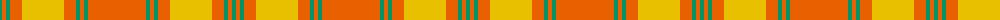

The parent of this is [Maguire Clan Family Tartan Tartan Number: 6812. Earliest known date: 2005 The first Scottish Maguire as recorded with Lord Lyon. The design is based on MacQuarrie and was created by FE Maguire at the House of Tartan in Comrie, Perthshire. The tartan is intended for the use of all Scottish Maguires. See products available Copyright © Blair Urquhart, Comrie, 2015](/tartans/b/4/oa4/b4/oa12/ya42/oa12/b4/oa4/b4/oa/58/)

This was sourced from house-of-tartan.  It is a [10 stripes tartan](/stripes/stripes10/).

Original link http://www.house-of-tartan.scotland.net/house/TartanViewjs.asp?colr=Def&tnam=6812

## Thread count
B/4 Oa4 B4 Oa12 Ya42 Oa12 B4 Oa4 B4 Oa/58

## Palette
Each colour and its ΔE from the base-6 reference it is a variant of.

| Colour | Shade | Base | ΔE (OKLab) |
|---|---|---|---|
| B |  `#009468` | G  | 0.16 |
| DO |  `#B84C00` | R  | 0.08 |
| DY |  `#BC8C00` | Y  | 0.16 |
| G |  `#00643C` | G  | 0.06 |
| N |  `#406054` | G  | 0.11 |
| O |  `#EC8048` | Y  | 0.17 |
| Oa |  `#E86000` | R  | 0.14 |
| Y |  `#D8B000` | Y  | 0.05 |
| Ya |  `#E8C000` | Y  | 0.00 |

ID: /variants/b/4/oa4/b4/oa12/ya42/oa12/b4/oa4/b4/oa/58-b009468-dob84c00-dybc8c00-g00643c-n406054-oec8048-oae86000-yd8b000-yae8c000/
