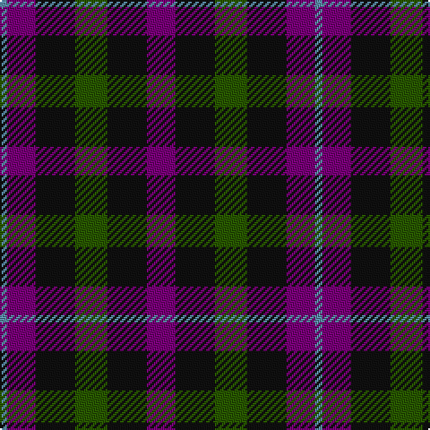

The parent of this is [Wilson's No.228 #2](/tartans/b/4/p16/k22/g18/k22/p/16/)

This was sourced from register-of-tartans.  It is a [6 stripes tartan](/stripes/stripes6/).

Original link https://www.tartanregister.gov.uk/tartanDetails.aspx?ref=4756

## Thread count
B/4 P16 K22 G18 K22 P/16

## Palette
Each colour and its ΔE from the base-6 reference it is a variant of.

| Colour | Shade | Base | ΔE (OKLab) |
|---|---|---|---|
| B |  `#5C8CA8` | B  | 0.23 |
| G |  `#285800` | G  | 0.04 |
| K |  `#101010` | K  | 0.17 |
| P |  `#780078` | B  | 0.16 |

# Sample pattern

ID: /variants/b/4/p16/k22/g18/k22/p/16-b5c8ca8-g285800-k101010-p780078/
