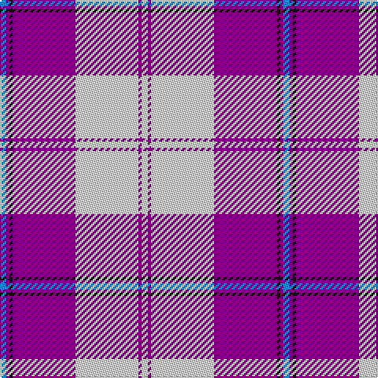

The parent of this is [Cunningham Dress Purple (Dance) Fashion Tartan Tartan Number: 6531. Earliest known date: 01/01/1986 A dancers' tartan from D C Dalgliesh of Selkirk. See products available Copyright © Blair Urquhart, Comrie, 2015](/tartans/b/4/p2/k2/p40/ln40/p2/ln/4/)

This was sourced from house-of-tartan.  It is a [7 stripes tartan](/stripes/stripes7/).

Original link http://www.house-of-tartan.scotland.net/house/TartanViewjs.asp?colr=Def&tnam=6531

## Thread count
B/4 P2 K2 P40 LN40 P2 LN/4

## Palette
Each colour and its ΔE from the base-6 reference it is a variant of.

| Colour | Shade | Base | ΔE (OKLab) |
|---|---|---|---|
| B |  `#2888C4` | B  | 0.21 |
| K |  `#101010` | K  | 0.17 |
| LN |  `#E0E0E0` | W  | 0.06 |
| P |  `#780078` | B  | 0.16 |

# Sample pattern

ID: /variants/b/4/p2/k2/p40/ln40/p2/ln/4-b2888c4-k101010-lne0e0e0-p780078/
