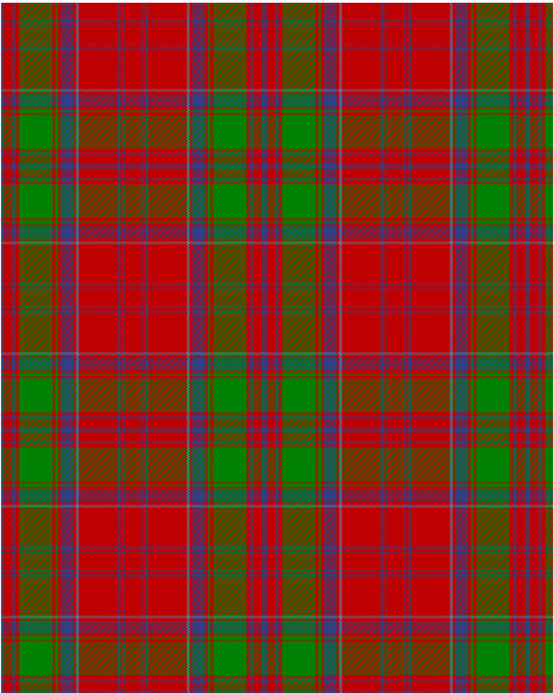

The parent of this is [Drummond](/tartans/b/4/r12/b4/r6/g48/r4/g4/r4/b18/r4/ba4/r56/b4/r4/b2/r/12/)

This was sourced from <no value>.  It is a [16 stripes tartan](/stripes/stripes16/).

Original link http://www.weddslist.com/cgi-bin/tartans/pg.pl?source=sts

## Thread count
B/4 R12 B4 R6 G48 R4 G4 R4 B18 R4 BA4 R56 B4 R4 B2 R/12

## Palette
B BA G R

# Sample pattern

ID: /variants/b/4/r12/b4/r6/g48/r4/g4/r4/b18/r4/ba4/r56/b4/r4/b2/r/12-b304080-ba5480b0-g008000-rc00000/