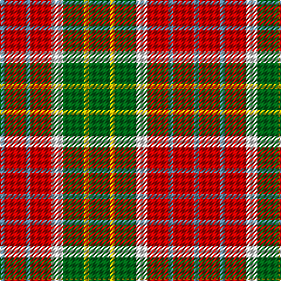

The parent of this is [Blackie (Artefact)](/tartans/b/4/r18/b4/r18/ln10/g18/y4/g/18/)

This was sourced from tartans-authority.  It is a [8 stripes tartan](/stripes/stripes8/).

Original link http://www.tartansauthority.com/tartan-ferret/display/7184/

## Thread count
B/4 R18 B4 R18 LN10 G18 Y4 G/18

## Palette
Each colour and its ΔE from the base-6 reference it is a variant of.

| Colour | Shade | Base | ΔE (OKLab) |
|---|---|---|---|
| B |  `#5C8CA8` | B  | 0.23 |
| G |  `#006818` | G  | 0.02 |
| LN |  `#E0E0E0` | W  | 0.06 |
| R |  `#C80000` | R  | 0.00 |
| Y |  `#E8C000` | Y  | 0.00 |

# Sample pattern

ID: /variants/b/4/r18/b4/r18/ln10/g18/y4/g/18-b5c8ca8-g006818-lne0e0e0-rc80000-ye8c000/
