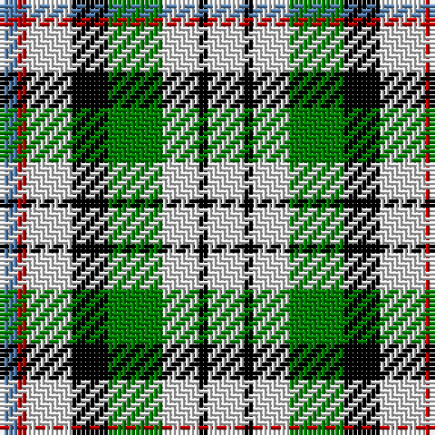

The parent of this is [MacDuff, dress](/tartans/b/4/r2/ln10/k8/g12/ln8/k2/ln/8/)

This was sourced from weddslist.  It is a [8 stripes tartan](/stripes/stripes8/).

Original link http://www.weddslist.com/cgi-bin/tartans/pg.pl?source=sts

## Thread count
B/4 R2 LN10 K8 G12 LN8 K2 LN/8

## Palette
Each colour and its ΔE from the base-6 reference it is a variant of.

| Colour | Shade | Base | ΔE (OKLab) |
|---|---|---|---|
| B |  `#5480B0` | B  | 0.20 |
| G |  `#008000` | G  | 0.09 |
| K |  `#000000` | K  | 0.00 |
| LN |  `#E0E0E0` | W  | 0.06 |
| R |  `#C00000` | R  | 0.02 |

# Sample pattern

ID: /variants/b/4/r2/ln10/k8/g12/ln8/k2/ln/8-b5480b0-g008000-k000000-lne0e0e0-rc00000/
