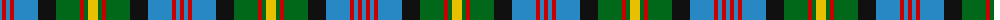

The parent of this is [Lobban (Personal)](/tartans/b/4/r4/b4/r4/b24/k18/g24/r4/g4/y10/g4/r4/g24/k18/b24/r4/b4/r/4/)

This was sourced from register-of-tartans.  It is a [18 stripes tartan](/stripes/stripes18/).

Original link https://www.tartanregister.gov.uk/tartanDetails.aspx?ref=2142

## Thread count
B/4 R4 B4 R4 B24 K18 G24 R4 G4 Y10 G4 R4 G24 K18 B24 R4 B4 R/4

## Palette
Each colour and its ΔE from the base-6 reference it is a variant of.

| Colour | Shade | Base | ΔE (OKLab) |
|---|---|---|---|
| B |  `#2888C4` | B  | 0.21 |
| G |  `#006818` | G  | 0.02 |
| K |  `#101010` | K  | 0.17 |
| R |  `#C80000` | R  | 0.00 |
| Y |  `#E8C000` | Y  | 0.00 |

ID: /variants/b/4/r4/b4/r4/b24/k18/g24/r4/g4/y10/g4/r4/g24/k18/b24/r4/b4/r/4-b2888c4-g006818-k101010-rc80000-ye8c000/
