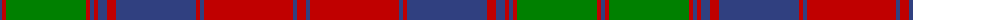

The parent of this is [Fraser of Altyre](/tartans/b/4/r4/g80/r4/b4/r4/b9/r9/b80/r4/b4/r89/b4/r/9/)

This was sourced from weddslist.  It is a [14 stripes tartan](/stripes/stripes14/).

Original link http://www.weddslist.com/cgi-bin/tartans/pg.pl?source=sts

## Thread count
B/4 R4 G80 R4 B4 R4 B9 R9 B80 R4 B4 R89 B4 R/9

## Palette
Each colour and its ΔE from the base-6 reference it is a variant of.

| Colour | Shade | Base | ΔE (OKLab) |
|---|---|---|---|
| B |  `#304080` | B  | 0.01 |
| G |  `#008000` | G  | 0.09 |
| R |  `#C00000` | R  | 0.02 |

ID: /variants/b/4/r4/g80/r4/b4/r4/b9/r9/b80/r4/b4/r89/b4/r/9-b304080-g008000-rc00000/
