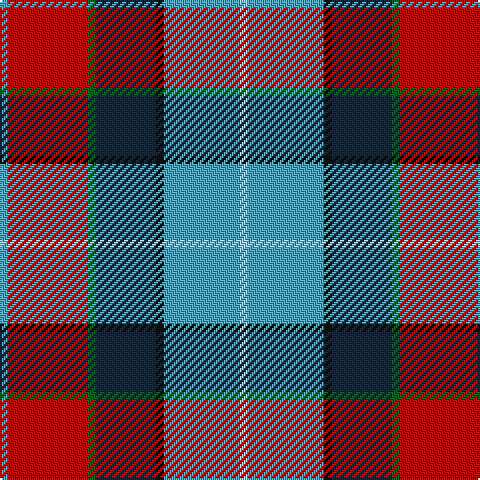

The parent of this is [Wallace Memorial Centenary](/tartans/b/4/r40/g4/dn30/k4/b38/lb/4/)

This was sourced from tartans-authority.  It is a [7 stripes tartan](/stripes/stripes7/).

Original link http://www.tartansauthority.com/tartan-ferret/display/10680/

## Thread count
B/4 R40 G4 DN30 K4 B38 LB/4

## Palette
Each colour and its ΔE from the base-6 reference it is a variant of.

| Colour | Shade | Base | ΔE (OKLab) |
|---|---|---|---|
| B |  `#48A4C0` | Y  | 0.28 |
| DN |  `#14283C` | B  | 0.14 |
| G |  `#006818` | G  | 0.02 |
| K |  `#101010` | K  | 0.17 |
| LB |  `#98C8E8` | W  | 0.17 |
| R |  `#C80000` | R  | 0.00 |

# Sample pattern

ID: /variants/b/4/r40/g4/dn30/k4/b38/lb/4-b48a4c0-dn14283c-g006818-k101010-lb98c8e8-rc80000/
