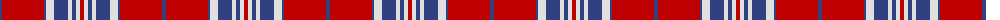

The parent of this is [31, Tartan (The.. )](/tartans/b/4/r42/b2/ln8/b14/ln4/b4/ln4/r/4/)

This was sourced from weddslist.  It is a [9 stripes tartan](/stripes/stripes9/).

Original link http://www.weddslist.com/cgi-bin/tartans/pg.pl?source=sts

## Thread count
B/4 R42 B2 LN8 B14 LN4 B4 LN4 R/4

## Palette
Each colour and its ΔE from the base-6 reference it is a variant of.

| Colour | Shade | Base | ΔE (OKLab) |
|---|---|---|---|
| B |  `#304080` | B  | 0.01 |
| LN |  `#E0E0E0` | W  | 0.06 |
| R |  `#C00000` | R  | 0.02 |

ID: /variants/b/4/r42/b2/ln8/b14/ln4/b4/ln4/r/4-b304080-lne0e0e0-rc00000/
