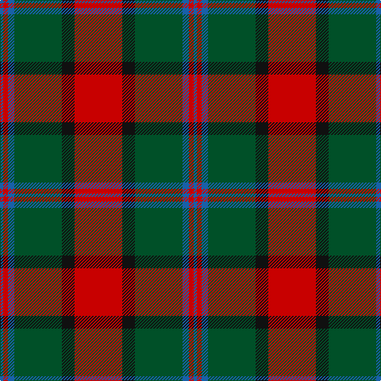

The parent of this is [Plummer Family Personal Tartan Tartan Number: 2778. Earliest known date: 2001 From a D C Dalgliesh swatch in 2001 via Phil Smith June 2004. See products available Copyright © Blair Urquhart, Comrie, 2015](/tartans/b/4/r6/b8/g60/k16/r/60/)

This was sourced from house-of-tartan.  It is a [6 stripes tartan](/stripes/stripes6/).

Original link http://www.house-of-tartan.scotland.net/house/TartanViewjs.asp?colr=Def&tnam=2778

## Thread count
B/4 R6 B8 G60 K16 R/60

## Palette
Each colour and its ΔE from the base-6 reference it is a variant of.

| Colour | Shade | Base | ΔE (OKLab) |
|---|---|---|---|
| B |  `#1860A8` | B  | 0.10 |
| DB |  `#1C0070` | B  | 0.14 |
| DG |  `#003000` | G  | 0.18 |
| G |  `#005028` | G  | 0.08 |
| K |  `#101010` | K  | 0.17 |
| N |  `#3C3C60` | B  | 0.06 |
| R |  `#C80000` | R  | 0.00 |

# Sample pattern

ID: /variants/b/4/r6/b8/g60/k16/r/60-b1860a8-db1c0070-dg003000-g005028-k101010-n3c3c60-rc80000/
