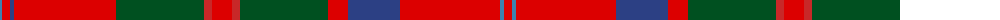

The parent of this is [MacQuarrie #2](/tartans/b/4/r8/ba4/r102/g88/ra8/r20/ra8/g88/r20/ba52/r100/b4/r/8/)

This was sourced from register-of-tartans.  It is a [14 stripes tartan](/stripes/stripes14/).

Original link https://www.tartanregister.gov.uk/tartanDetails.aspx?ref=2729

## Thread count
B/4 R8 Ba4 R102 G88 Ra8 R20 Ra8 G88 R20 Ba52 R100 B4 R/8

## Palette
Each colour and its ΔE from the base-6 reference it is a variant of.

| Colour | Shade | Base | ΔE (OKLab) |
|---|---|---|---|
| B |  `#3C82AF` | B  | 0.20 |
| Ba |  `#2C4084` | B  | 0.00 |
| G |  `#005020` | G  | 0.08 |
| R |  `#DC0000` | R  | 0.04 |
| Ra |  `#C82828` | R  | 0.03 |

ID: /variants/b/4/r8/ba4/r102/g88/ra8/r20/ra8/g88/r20/ba52/r100/b4/r/8-b3c82af-ba2c4084-g005020-rdc0000-rac82828/
