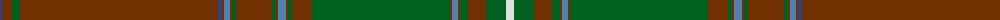

The parent of this is [Unidentified Plaid 1](/tartans/b/4/t10/g8/t198/b4/t2/ba6/t2/g4/t36/g4/t2/ba8/t2/g4/t20/g138/t2/ba6/t2/g8/t18/g20/ln/8/)

This was sourced from weddslist.  It is a [24 stripes tartan](/stripes/stripes24/).

Original link http://www.weddslist.com/cgi-bin/tartans/pg.pl?source=sts

## Thread count
B/4 T10 G8 T198 B4 T2 Ba6 T2 G4 T36 G4 T2 Ba8 T2 G4 T20 G138 T2 Ba6 T2 G8 T18 G20 LN/8

## Palette
Each colour and its ΔE from the base-6 reference it is a variant of.

| Colour | Shade | Base | ΔE (OKLab) |
|---|---|---|---|
| B |  `#304080` | B  | 0.01 |
| Ba |  `#5480B0` | B  | 0.20 |
| G |  `#006020` | G  | 0.03 |
| LN |  `#E0E0E0` | W  | 0.06 |
| T |  `#703000` | R  | 0.18 |

ID: /variants/b/4/t10/g8/t198/b4/t2/ba6/t2/g4/t36/g4/t2/ba8/t2/g4/t20/g138/t2/ba6/t2/g8/t18/g20/ln/8-b304080-ba5480b0-g006020-lne0e0e0-t703000/
