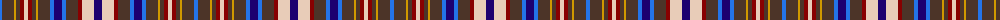

The parent of this is [Wcwm 1572-1](/tartans/b/4/t12/dy2/t4/dr4/lr4/dr4/t4/dy2/t12/b4/db8/b4/t12/dr4/lr12/db/8/)

This was sourced from register-of-tartans.  It is a [17 stripes tartan](/stripes/stripes17/).

Original link https://www.tartanregister.gov.uk/tartanDetails.aspx?ref=4532

## Thread count
B/4 T12 DY2 T4 DR4 LR4 DR4 T4 DY2 T12 B4 DB8 B4 T12 DR4 LR12 DB/8

## Palette
Each colour and its ΔE from the base-6 reference it is a variant of.

| Colour | Shade | Base | ΔE (OKLab) |
|---|---|---|---|
| B |  `#2474E8` | B  | 0.20 |
| DB |  `#1C0070` | B  | 0.14 |
| DR |  `#880000` | R  | 0.14 |
| DY |  `#D09800` | Y  | 0.11 |
| LR |  `#E8CCB8` | W  | 0.11 |
| T |  `#4C3428` | B  | 0.16 |

ID: /variants/b/4/t12/dy2/t4/dr4/lr4/dr4/t4/dy2/t12/b4/db8/b4/t12/dr4/lr12/db/8-b2474e8-db1c0070-dr880000-dyd09800-lre8ccb8-t4c3428/
