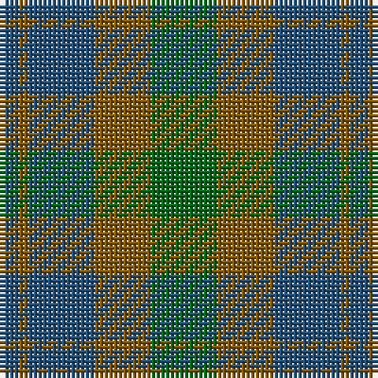

The parent of this is [Bright of Garth (Personal)](/tartans/b/4/t2/b14/t12/g/14/)

This was sourced from tartans-authority.  It is a [5 stripes tartan](/stripes/stripes5/).

Original link http://www.tartansauthority.com/tartan-ferret/display/6576/

## Thread count
B/4 T2 B14 T12 G/14

## Palette
Each colour and its ΔE from the base-6 reference it is a variant of.

| Colour | Shade | Base | ΔE (OKLab) |
|---|---|---|---|
| B |  `#245078` | B  | 0.05 |
| G |  `#006818` | G  | 0.02 |
| T |  `#845800` | G  | 0.16 |

# Sample pattern

ID: /variants/b/4/t2/b14/t12/g/14-b245078-g006818-t845800/
