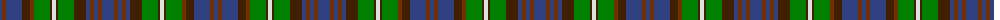

The parent of this is [Forbes, of Druminnor](/tartans/b/4/t4/b16/dr8/ta4/g16/dr2/ln4/dr2/g16/dr12/b4/t4/b4/t4/b/12/)

This was sourced from weddslist.  It is a [16 stripes tartan](/stripes/stripes16/).

Original link http://www.weddslist.com/cgi-bin/tartans/pg.pl?source=sts

## Thread count
B/4 T4 B16 DR8 Ta4 G16 DR2 LN4 DR2 G16 DR12 B4 T4 B4 T4 B/12

## Palette
Each colour and its ΔE from the base-6 reference it is a variant of.

| Colour | Shade | Base | ΔE (OKLab) |
|---|---|---|---|
| B |  `#304080` | B  | 0.01 |
| DR |  `#402000` | B  | 0.21 |
| G |  `#008000` | G  | 0.09 |
| LN |  `#E0E0E0` | W  | 0.06 |
| T |  `#703000` | R  | 0.18 |
| Ta |  `#703000` | R  | 0.18 |

ID: /variants/b/4/t4/b16/dr8/ta4/g16/dr2/ln4/dr2/g16/dr12/b4/t4/b4/t4/b/12-b304080-dr402000-g008000-lne0e0e0-t703000-ta703000/
