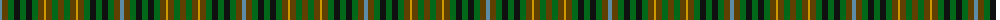

The parent of this is [Buchanan Htg (Scott Adie) (Fashion)](/tartans/b/4/t6/g6/k6/g6/k6/g6/t6/dy2/t6/g6/t/6/)

This was sourced from tartans-authority.  It is a [12 stripes tartan](/stripes/stripes12/).

Original link http://www.tartansauthority.com/tartan-ferret/display/3749/

## Thread count
B/4 T6 G6 K6 G6 K6 G6 T6 DY2 T6 G6 T/6

## Palette
Each colour and its ΔE from the base-6 reference it is a variant of.

| Colour | Shade | Base | ΔE (OKLab) |
|---|---|---|---|
| B |  `#5C8CA8` | B  | 0.23 |
| DY |  `#D09800` | Y  | 0.11 |
| G |  `#006818` | G  | 0.02 |
| K |  `#101010` | K  | 0.17 |
| T |  `#604000` | G  | 0.14 |

ID: /variants/b/4/t6/g6/k6/g6/k6/g6/t6/dy2/t6/g6/t/6-b5c8ca8-dyd09800-g006818-k101010-t604000/
