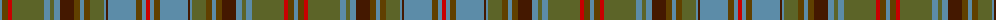

The parent of this is [Unidentified (Woven sample)](/tartans/b/4/t6/r4/g32/b6/g4/b6/dr14/t6/b4/t6/g14/b2/dr2/b28/t6/b4/r/4/)

This was sourced from tartans-authority.  It is a [18 stripes tartan](/stripes/stripes18/).

Original link http://www.tartansauthority.com/tartan-ferret/display/7934/

## Thread count
B/4 T6 R4 G32 B6 G4 B6 DR14 T6 B4 T6 G14 B2 DR2 B28 T6 B4 R/4

## Palette
Each colour and its ΔE from the base-6 reference it is a variant of.

| Colour | Shade | Base | ΔE (OKLab) |
|---|---|---|---|
| B |  `#5C8CA8` | B  | 0.23 |
| DR |  `#441800` | B  | 0.22 |
| G |  `#5C6428` | G  | 0.09 |
| R |  `#C80000` | R  | 0.00 |
| T |  `#604000` | G  | 0.14 |

ID: /variants/b/4/t6/r4/g32/b6/g4/b6/dr14/t6/b4/t6/g14/b2/dr2/b28/t6/b4/r/4-b5c8ca8-dr441800-g5c6428-rc80000-t604000/
