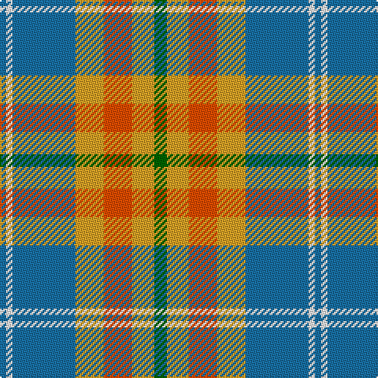

The parent of this is [Tombow 140th Anniversary, The](/tartans/b/4/w4/b40/y18/r18/y14/g/8/)

This was sourced from register-of-tartans.  It is a [7 stripes tartan](/stripes/stripes7/).

Original link https://www.tartanregister.gov.uk/tartanDetails.aspx?ref=11220

## Thread count
B/4 W4 B40 Y18 R18 Y14 G/8

## Palette
Each colour and its ΔE from the base-6 reference it is a variant of.

| Colour | Shade | Base | ΔE (OKLab) |
|---|---|---|---|
| B |  `#1870A4` | B  | 0.14 |
| G |  `#006400` | G  | 0.00 |
| R |  `#FA4B00` | R  | 0.14 |
| W |  `#FFFFFF` | W  | 0.03 |
| Y |  `#E0A126` | Y  | 0.08 |

# Sample pattern

ID: /variants/b/4/w4/b40/y18/r18/y14/g/8-b1870a4-g006400-rfa4b00-wffffff-ye0a126/
