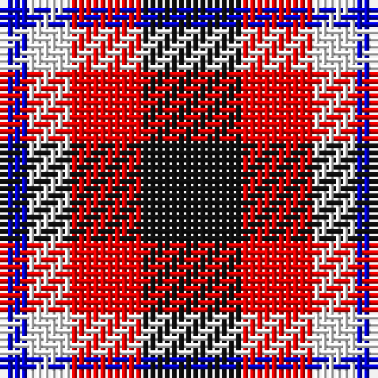

The parent of this is [Thomas Newcomen's Combustion Engine](/tartans/b/4/w6/r10/k/14/)

This was sourced from register-of-tartans.  It is a [4 stripes tartan](/stripes/stripes4/).

Original link https://www.tartanregister.gov.uk/tartanDetails.aspx?ref=10849

## Thread count
B/4 W6 R10 K/14

## Palette
Each colour and its ΔE from the base-6 reference it is a variant of.

| Colour | Shade | Base | ΔE (OKLab) |
|---|---|---|---|
| B |  `#0000CD` | B  | 0.15 |
| K |  `#101010` | K  | 0.17 |
| R |  `#FF0000` | R  | 0.11 |
| W |  `#FFFFFF` | W  | 0.03 |

# Sample pattern

ID: /variants/b/4/w6/r10/k/14-b0000cd-k101010-rff0000-wffffff/
