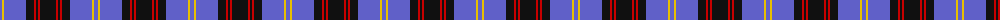
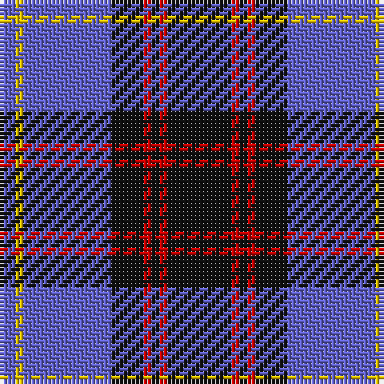

The parent of this is [Rutherford (Name)](/tartans/b/4/y2/b22/k8/r2/k2/r2/k/16/)

This was sourced from tartans-authority.  It is a [8 stripes tartan](/stripes/stripes8/).

Original link http://www.tartansauthority.com/tartan-ferret/display/6926/

## Thread count
B/4 Y2 B22 K8 R2 K2 R2 K/16

## Palette
Each colour and its ΔE from the base-6 reference it is a variant of.

| Colour | Shade | Base | ΔE (OKLab) |
|---|---|---|---|
| B |  `#6060C8` | B  | 0.16 |
| K |  `#101010` | K  | 0.17 |
| R |  `#C80000` | R  | 0.00 |
| Y |  `#E8C000` | Y  | 0.00 |

# Sample pattern

ID: /variants/b/4/y2/b22/k8/r2/k2/r2/k/16-b6060c8-k101010-rc80000-ye8c000/
